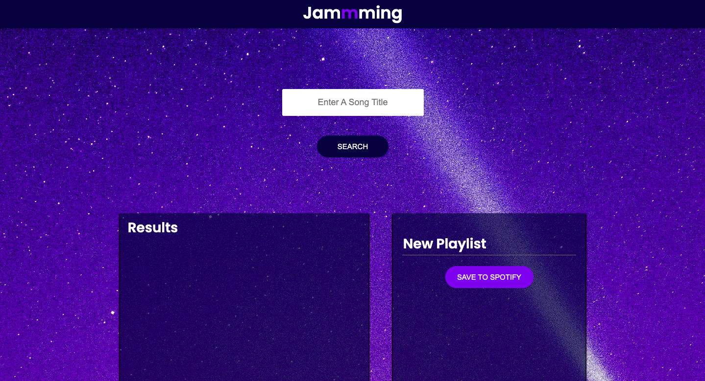

# Jammming - React Spotify Playlist Manager



## Table of Contents

- [Overview](#overview)
- [Project Requirements](#project-requirements)
- [Features](#features)
- [Technologies Used](#technologies-used)
- [Getting Started](#getting-started)
- [Usage](#usage)
- [Future Work](#future-work)
- [Contributing](#contributing)
- [License](#license)

## Overview

Jammming is a web application built with React that allows users to search the Spotify library, create custom playlists, and save them to their Spotify accounts. With Jammming, you can easily manage your music collection and create playlists that match your mood or style.

## Project Requirements

Jammming was created to meet the following project requirements:

- Build a web app using React.
- Version control the application with Git and host the repository on GitHub.
- Integrate with the Spotify API.
- Deploy the application.

## Features

Jammming offers a variety of features to enhance your music management experience:

- **Search for Songs:** Search for songs by song title, artist, or other attributes.

- **Song Details:** View detailed information about each song, including title, artist, and album.

- **Custom Playlists:** Create custom playlists by adding songs from the search results.

- **Save to Spotify:** Save your custom playlists to your personal Spotify account.

## Technologies Used

Jammming leverages the following technologies:

- **React:** The frontend framework used for building the user interface and managing state.

- **Spotify API:** To search for songs, retrieve song details, and save playlists to Spotify accounts.

- **HTML/CSS:** For structuring the web page and styling the user interface.

- **JavaScript:** For interactivity and managing application logic.

- **GitHub:** For version control and project hosting.

## Getting Started

To run Jammming locally on your machine, follow these steps:

1. **Clone the Repository:** Clone this repository to your local machine using Git:

   ```shell
   git clone https://github.com/shafihi/jammming.git
   ```

2. **Navigate to Project Directory:** Navigate to the project directory:

   ```shell
   cd jammming
   ```

3. **Install Dependencies:** Install the required dependencies:

   ```shell
   npm install
   ```

4. **Configure Spotify API:** Create a `.env.local` file in the project's root directory with your Spotify API credentials. Obtain these credentials by creating a Spotify Developer App in your Spotify Developer Dashboard.

   ```env
   REACT_APP_SPOTIFY_CLIENT_ID=your_client_id
   REACT_APP_SPOTIFY_REDIRECT_URI=http://localhost:3000/callback
   ```

5. **Start Development Server:** Start the development server:

   ```shell
   npm start
   ```

6. **Access the App:** Open your web browser and visit [http://localhost:3000](http://localhost:3000) to use Jammming locally.

## Usage

1. **Search for Songs:** Enter a song title, artist, or any relevant keyword in the search bar.

2. **Start Searching:** Click the "Search" button to fetch matching songs from the Spotify library.

3. **Add to Playlist:** Browse the search results and click the "+" button next to a song to add it to your custom playlist.

4. **Custom Playlists:** To create a custom playlist, click the playlist name to edit it, and click the "Save" button to save the playlist to your Spotify account.

## Future Work

Here are some possible future enhancements for Jammming:

- **User Authentication:** Implement user authentication to enable multiple users to manage their playlists.

- **Track Deletion:** Add the ability to delete tracks from custom playlists.

- **Enhanced UI:** Enhance the user interface with more advanced styling and features.

## Contributing

Contributions are welcome! If you'd like to contribute to Jammming, please follow these steps:

1. **Fork the Repository:** Fork the repository.

2. **Create a New Branch:** Create a new branch for your feature or bug fix.

3. **Make Changes:** Make your changes and test them thoroughly.

4. **Commit and Push:** Commit your changes and push them to your fork.

5. **Submit a Pull Request:** Submit a pull request, describing the changes you made and why they should be merged.

## License

This project is licensed under the MIT License. See the [LICENSE](LICENSE) file for details.
